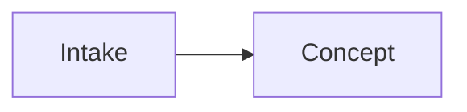

# Conventions — the human↔Claude contract

This file defines **how every note in this vault is written**, so the design is equally readable by a human in Obsidian and by Claude as plain text. Follow it and Claude can reconstruct the whole system from the files alone.

## 1. Every note starts with frontmatter

```yaml
---
title: Human readable title
type: charter | strategy | engine | architecture | data | platform | operations | flow | adr | glossary | meta
status: draft | accepted | implemented | deprecated
updated: YYYY-MM-DD
tags: []
related: ["[[Other Note]]"]   # wikilinks to connected notes
---
```

- `type` tells Claude what kind of content to expect and which template applies.
- `status` tells Claude how much to trust it. `draft` = written, but the human has not ruled on it — a proposal, never a decision. `accepted` = decided. `implemented` = exists in the code. `deprecated` = ignore unless doing history.
- `updated` is the last-edited date, always `YYYY-MM-DD`. Bump it when you change the note.
- `related` is the explicit graph — the notes this one depends on or references.

### `type: platform` carries two extra fields — and they are mandatory

```yaml
verified: YYYY-MM-DD          # the day a human or Claude last checked this against the source
sources: ["https://…"]        # where each claim came from
```

**This is the one field this vault adds beyond the parent standard, and it exists for a specific reason.** Platform facts — API pricing, posting quotas, policy, audit gates — are the only claims here that can become false *without anyone touching the note*. Every other kind of drift in this vault is caused by an edit. Platform drift is caused by the calendar.

An undated platform claim is worse than no claim, because it is trusted. `check-vault.mjs` fails on a `type: platform` note missing either field and warns when `verified` goes stale.

## 2. Two kinds of document, and the difference is absolute

This is the spine of the whole standard. Every note in this vault is one or the other.

| | **Decisions** (`Decisions/`, `type: adr`) | **Living notes** (everything else) |
|---|---|---|
| Mutability | **Immutable once `accepted`** | Edited in place, freely |
| Changing it | Write a **new ADR that supersedes it** | Edit the note, bump `updated:` |
| Answers | *Why* we chose what we chose | *What* the system currently is |
| Recreating it | Never | Never — edit it, don't rewrite it from scratch |

A living note describes the world **as it is now**, and derives its authority from the decisions beneath it. An ADR describes **a choice made on a date**, and stays true forever because it is a record of that moment, not of the present.

When the two disagree, the ADR is what was decided and the living note is what is — which means either the living note is stale, or a decision was made without an ADR. Both are defects. Surface them; do not pick a winner silently.

## 3. Decisions are recorded, not just made

Any non-trivial choice becomes an ADR: copy `_templates/ADR.md` into `Decisions/`, next zero-padded number, never renumbered. The living note that *uses* the decision links to the ADR. That keeps the *why* next to the *what*.

**An accepted ADR is immutable.** To change one, write a new ADR that supersedes it; never rewrite an accepted body. Three narrow exceptions:

- **A rename may repoint an ADR's links — nothing else may be touched.** A link target is not content.
- **When an ADR's text has gone stale, *where* the stale text sits decides how to fix it.** Stale text inside **Decision** gets a dated banner on the ADR body, because it misleads about what was decided. Stale text in **Consequences** — an aside about a neighbouring concern the ADR explicitly declined to decide — gets a note on its **[[_ADR Index]] row instead**, body untouched. Choosing banner-vs-index-note by *where the text sits* is the reusable half of this rule.
- **A same-session amendment, made before anything depends on the original wording,** may be applied in place **provided the original text is preserved alongside it** — which is the purpose immutability serves.

**Never cite anything impermanent from an ADR body** — see §6.

### An ADR records a decision the human made

Claude proposes; the human decides; then it is written. **Claude must never author an ADR for a choice the human has not actually made**, and must never present its own reasoning in a form that reads as settled record.

**Claude never sets `status: accepted`.** Every ADR Claude writes is created as `status: draft` and stays there. Claude then tells the human the draft is ready and states plainly what it decides. The human reviews it and rules on it. Only that instruction changes the status — never Claude's own judgment that the draft is sound.

A draft ADR is a proposal that happens to live in a file. It is not a decision: it gets **no row in [[_ADR Index]]**, and no living note may cite it as settled. `_meta/check-vault.mjs` lists every draft on every run, so one cannot sit unread and quietly become the parking lot this vault refuses to keep (§6).

Formatting a proposal as a ratified record launders opinion into permanence, and nothing downstream can tell the difference afterward — the log says *decided*, and the reader has no way to learn otherwise.

**An open choice is not written to the vault at all.** It stays in conversation until the human decides it, and only the decision is recorded. This vault keeps **no register of the undecided** — no parking lot, no open-questions note, no backlog of things to settle later. Such a register is a handoff document wearing a different name (§6): it is accurate the day it is written, nothing goes back to retire a row once the question is answered in passing, and an agent reading it proposes work the human already resolved.

**The one case that looks like an exception, and is not.** A choice the human has *deliberately deferred* — "we are not deciding storage until the ingest path is proven" — is itself a decision, with a rationale and a trigger condition. It gets an **ADR**, `status: accepted`, stating what is deferred and what would end the deferral. That is strictly better than a parking-lot row: it carries the *why*, it is immutable, and the ADR that later settles the question supersedes it in the normal way.

## 4. All diagrams are Mermaid — no images

Never paste screenshots or binary diagram files. **Nor a drawing in any other wrapper** — the ban is on the *content*, not the file format: a scene stored as JSON inside a Markdown file is still a drawing. Diagrams live in fenced blocks:

````

````

This renders in Obsidian **and** is plain text Claude reads losslessly. Diagram type by purpose:

| Purpose | Mermaid type |
|---|---|
| System structure (context, containers, modules) | `flowchart` with `subgraph`s |
| Entity / data model | `erDiagram` |
| A journey or a pipeline pass | `sequenceDiagram` |
| Lifecycle / status machine (e.g. a content item's states) | `stateDiagram-v2` |
| Process / decision logic (e.g. an approval gate) | `flowchart` |

### Data-model granularity — model the concept, not the schema

Wherever this vault's ER diagram lives, it is the **conceptual** model. Physical columns live in the codebase and its schema definitions, never duplicated into the diagram, or they drift. Per entity show only: `id`; the **discriminators/enums that drive behavior** (`status`, `kind`, and whatever else branches the logic); one to three defining attributes; and relationship-bearing FKs where they carry meaning. Omit timestamps unless semantically load-bearing, derived columns, physical types, and indexes.

## 5. Naming & structure

- **Folders are named, never numbered, and exactly one level deep.** No subdirectories anywhere. Numbering implies a reading sequence that folder names do not carry.
- **[[_meta/manifest|The manifest]] carries the reading order.** That is the one place a sequence belongs.
- Index/aggregator notes are prefixed `_` (e.g. `_ADR Index`).
- ADRs: `ADR-NNNN - short title.md`, zero-padded, never renumbered.
- One concept per note. Link generously with `[[wikilinks]]`.

## 6. Nothing transient lives in this vault

**This vault houses the design, and only the design.** A document that belongs here is **true indefinitely** — the architecture, the data model, the system's components, the decisions, the platform constraints. A document describing *what we are doing this week* does not belong here at any size.

**Banned outright, in every folder, under any filename:** handoffs · build plans · phase plans · roadmaps · checklists · to-do lists · session notes · progress snapshots · "current state" briefs · **open-questions notes · parking lots · backlogs** · scratch files · anything named `TEMP`/`WIP`/`DRAFT-`/`HANDOFF`. **Claude must not create one here, ever, for any reason** — not even as a convenience it intends to delete later. `check-vault.mjs` check 7 fails on these filenames.

**A register of the undecided is a handoff in disguise,** which is why it sits in that list. It reads as a live agenda and behaves as a stale one: a question answered in passing leaves its row standing, because nothing goes back to retire it, and the next agent proposes work the human settled a month ago. A session exists to answer open questions; the answer becomes an ADR or a living-note edit, and the question itself was never the asset.

**Where they go instead:**

| What it is | Where it lives |
|---|---|
| Agent scratch work, intermediate output, one-off scripts | the agent's **own scratch directory** — never the vault |
| Where the build stands; what ships next | the code repo |
| An open choice, an option, a recommendation | **conversation** — until the human decides it, then an ADR (§3) |
| A choice deliberately left open | an **ADR** naming what is deferred and what would end the deferral (§3) |
| A durable outcome that came *out of* transient work | folded into the **living note** it belongs to, or an **ADR** |

**The reasoning.** A transient note is accurate the day it is written and progressively false afterward — and because nothing goes back to retire it, it becomes a **second source of truth that disagrees with the first**. It is read as current: a stale plan carrying a false ✅ retires work that still has to be done, and a fresh agent cannot tell. Every such file is also permanent drift-check surface and permanent `/sync` cost.

**Corollaries:**

- **Never link from an ADR body to anything impermanent.** An accepted ADR is immutable (§3), so a pointer from one **pins its target in place permanently.** If an ADR must reference the *circumstances* of a decision — a plan, a conversation — it states them in its own words.
- **A dated record may name a deleted document; it may not link to one.**
- **If transient work produces something durable, land it in the living note before the work ends.** The handoff is not the deliverable; the updated design is.

### 6.1 A document never describes its own maturity

**No note states how complete it is, how new the vault is, what it is missing, or what a future reader should do about any of that.** This is §6's ban hiding inside a permanent document: the sentence is true the day it is written, false afterward, and nothing ever goes back to retire it.

The test is mechanical: **a line that is guaranteed to need overwriting is drift surface by construction — and if it is *not* overwritten, the drift shipped silently.** A line that can only be right on one day has no business in a document meant to be true on all of them.

**Banned, in every note including this one:**

| Banned | Why |
|---|---|
| "the vault was initialized on ⟨date⟩", "design not started", "barely started" | a status snapshot, stale the moment work continues |
| "currently empty", "near-empty", "still small", "no notes yet" | describes a moment, not the subject |
| "not yet written", "does not exist yet", "none yet", "so far", "for now", "at present" | announces an absence that the indexes already show |
| "as the vault grows", "once folders carry content", "re-measure this later", "this will change when" | an instruction to a future editor, i.e. a to-do list of one |
| "at the time of writing" | concedes the sentence has an expiry date |

**Write what is, not what is missing.** An absent note needs no announcement — the folder map, the indexes and `_meta/check-vault.mjs` already report what exists, and unlike prose they cannot silently disagree with the files.

**The narrow exception: a current-state claim a script enforces.** A statement about right now is permitted *only* when `_meta/check-vault.mjs` fails the moment it disagrees with the files on disk. That is the whole standard — **a current-state claim is allowed when, and only when, the guard makes drift impossible.** If you want to state a count, add the check in the same pass (§8); if you cannot check it, do not state it.

**Prefer deriving to stating.** Meeting that bar is not a reason to clear it. A written count earns its drift surface only when something reads the number *instead of* the files — and `/sync` reads every file, every session, so a count in a note tells an agent what it just finished counting. It also costs one drift site per place it appears, plus the check that polices them, plus the re-anchoring that check needs every time the line is reworded. **Derive it; do not write it down.**

**This does not ban `> [!todo]`.** A todo callout may name a gap in **the design** — the subject the note is about. It may never describe **the note's or the vault's own maturity, recency or size.** "The retry path is unspecified" is a fact about the system and stays true until the system changes. "This note is still short" is a fact about the day.

**Corollary for the reading order.** The manifest carries sequence, not progress. It lists what to read, never how far along the vault is.

## 7. No visual design lives in this vault

The vault carries the **verbal** half of design and none of the visual half. Mermaid (§4) is the sole exception, and only because a Mermaid diagram is a *structural* statement in text, never an appearance.

**Never in the vault:** mockups · wireframes · comps · drawings · screenshots · canvas scenes · rendered output · example artifacts as images · anything whose purpose is to show *what something looks like*.

**Wherever a design has a visual half, the line is worth stating precisely.** The distinction is always the same — the contract belongs here, the artifact does not:

| Verbal / technical — **belongs here** | Visual — **belongs outside** |
|---|---|
| Design tokens as **values**: hex codes, font names, a spacing scale | A rendered comp, a moodboard, a logo file |
| A format's **contract** — dimensions, duration, required elements, placement rules | A finished artifact that satisfies it |
| A **voice** or **style** specification and its written examples | A screenshot of something that reads or looks right |
| A production pipeline's inputs, stages and outputs | The artifacts it produced |

**Planning production and its technical requirements is correct work for this vault. Producing or storing the output is not.** Rendered artifacts live in the code repo or object storage; this vault describes how they are made and what they must satisfy.

## 8. How Claude should treat this vault

- **Source of truth = these files.** If memory and the vault disagree, the vault wins — and say so out loud.
- **The vault's subject is stated exactly once — in the [[Project Charter]].** The project's name, what it does, who it is for and what domain it lives in are written there and referred to everywhere else. ⚠ **Never restate them in another note**, however convenient: a subject described in two notes is a subject that gets corrected in one, and the reader cannot tell which copy is current. Link, do not repeat.
- Before recommending changes, read the `related` graph of the affected note.
- Keep [[_meta/manifest|the manifest]] current when adding, removing or renaming a note.
- **Surface conflicts; do not silently fix them.** Report and let the human decide.
- **A fact stated twice and corrected once is this standard's signature defect.** When a decision changes a field, a name or a rule, grep that term across **every** folder and fix all of it in one pass. ⚠ **A half-applied ripple is the most dangerous kind, because the note looks updated** — it carries the correction *and* an uncorrected copy, so the next reader trusts it. **When a countable fact can be checked by a script, add the check to `_meta/check-vault.mjs` in the same pass** instead of fixing the instance again.
