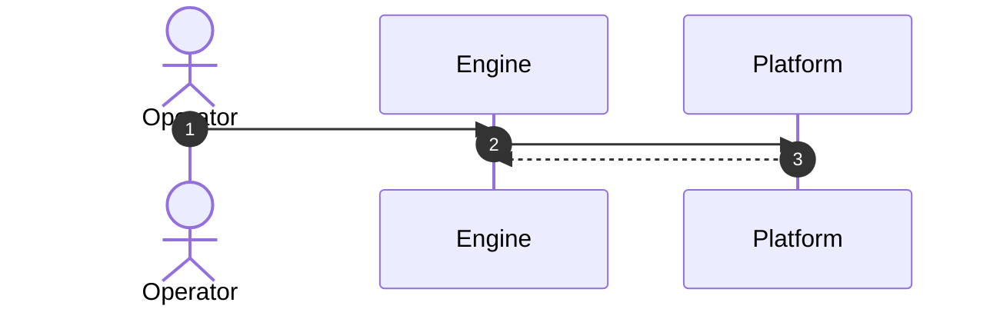

# Flow Name

> **Purpose:** One sentence — whose journey this is, and where it starts and ends.

## Actors

Who and what participates — the human operator, each engine module, each external service.

## Preconditions

What must already be true before this flow can begin.

## Sequence

## Failure paths

What can go wrong at each step, and where the flow resumes from. **Name the resume point, not just the error** — a flow that can only restart from zero is a design defect worth recording.

## Decisions

The ADRs this flow implements. `[[ADR-NNNN - title]]`
